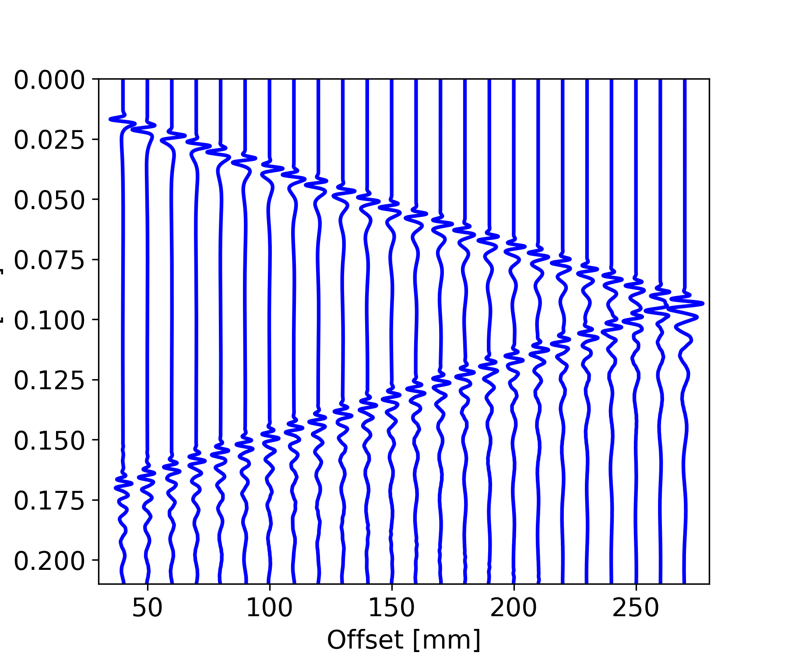
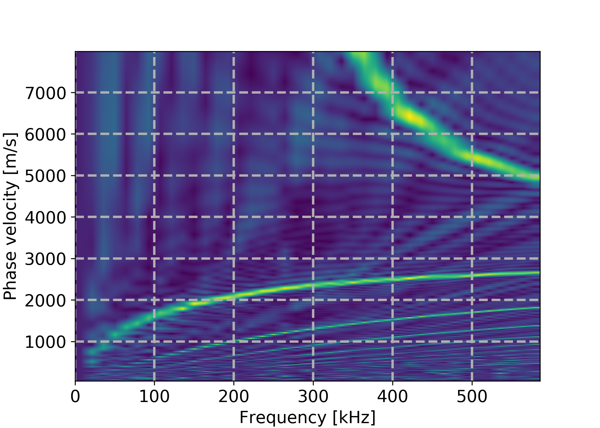

# PyDispersion
PyDispersion is a small package written in Python that reveals the dispersion curves of seismic array or ultrasonic phased array data. 

For example, this section of sthe strongly dispersive guided waves propagating in a thinned-wall pipe

will be converted in to the below dispersion image in which the main propagation mode as well as its wave speed can be read.

The package is used to generate dispersion curves of the cylindrically guided ultrasonic waves propagating in pipes reported in the conference paper:
Luan T. Nguyen, Georg K. Kocur, Erik H. Saenger. Ultrasonic pipe inspection by forward-reverse wavefield cross-correlation. 2nd Int. Symposium on SHM and NDT, Saarbrücken, Germany; 10/2018.

The below two methods are currently available in PyDispersion:
1. The phase shift method described in:
Park, C.B., Miller, R.D. and Xia, J., 1998, January. Imaging dispersion curves of surface waves on multi-channel record. In 1998 SEG Annual Meeting. Society of Exploration Geophysicists.
2. The slant stack method described in:
McMechan, G.A. and Yedlin, M.J., 1981. Analysis of dispersive waves by wave field transformation. Geophysics, 46(6), pp.869-874.

Available test data:
guided_waves_pipe: wave dispersion due to elastic waves guided in a pipe,
viscoelastic_waves: wave dispersion due to viscoelasticity.

To run one of the tests (on a system with standard Python and with obspy installed), change directory to the selected test under 'demos' and execute the Python script, for example:
$cd demos/guided_waves_pipe
$./get_dispersion_curves_L01.py
